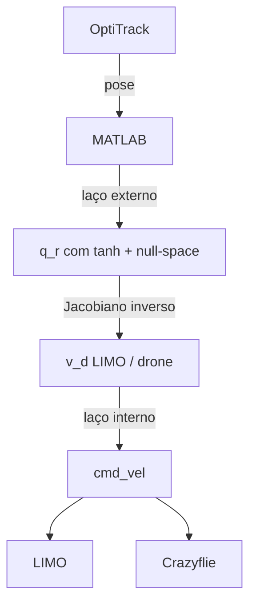

# KNOWLEDGE — Robótica Móvel 2026/1 (UFES)

Base de conhecimento do projeto, sintetizada a partir dos slides da disciplina (`Part *.pptx`), do [README.md](README.md), de [matlab/refence.m](matlab/refence.m) e da implementação em `src/`, [matlab/main.m](matlab/main.m) e [matlab/test_limo.m](matlab/test_limo.m).

Para reextrair texto dos slides:

```bash
uv run python scripts/extract_pptx.py
```

Saída: `docs/pptx_extract.txt`.

---

## 1. Contexto da disciplina

**Disciplina:** PGEE5558 — Mobile Robotics (Robótica Móvel)

**Abordagem geral:** modelagem cinemática → modelagem dinâmica → controle em cascata (inner–outer loop) → sistemas multi-robô (formações).

**Este repositório:** controle de **estrutura virtual** com:

| Agente | Simulador Python | Hardware lab |
|--------|------------------|--------------|
| Robô terrestre | LIMO (unicycle / differential) | AgileX **LIMO** (`L1`) |
| Aéreo | Bebop 2 (modelo dinâmico simplificado) | **Crazyflie** (`cfX`) via ROS |

> O enunciado cita Bebop 2; no lab usamos Crazyflie + `natnet_ros` + stack do professor ([matlab/refence.m](matlab/refence.m)).

---

## 2. Modelos cinemáticos (Part 2)

### 2.1 Robô diferencial / uniciclo (Part 2-1)

- Duas rodas de tração + roda castor (desprezada).
- Gira em torno do **ICR** (instantaneous center of rotation).
- **Não holonômico:** velocidade nula na direção do eixo virtual entre as rodas.
- Também chamado de **unicycle robot**.
- **PoI (point of interest):** ponto de controle deslocado do centro — usado no LIMO com offset `a = 0.10 m` no eixo X do robô.

**LIMO no lab:**

| Modo físico | Luz | Comando | Notas |
|-------------|-----|---------|-------|
| 4WD / diferencial | Amarela | `[v; ω]` | Giro no próprio eixo; coerente com uniciclo |
| Car-like (Ackermann) | Verde | `[v; ω]` acoplados | **Não** gira no eixo; raio mín ~0,4 m |
| Omni (Mecanum) | Azul | `[vx; vy; ω]` | Só LIMO 105 + `use_mcnamu:=true` |

Config MATLAB: `cfg.limo_steering_mode = '4wd' | 'carlike' | 'omni'`.

### 2.2 Omnidirecional (Part 2-2)

- Velocidade linear em (quase) qualquer direção (Mecanum, omni wheels).
- LIMO 105 com `Linear.Y` no `cmd_vel`.

### 2.3 Quadrotor (Part 2-3)

- Quatro motores; combinações de rotação geram movimento e atitude.
- **Comando cinemático simplificado (lab):** `[φ; θ; ż; ψ̇]` via `cmd_vel` (Crazyflie).
- Firmware faz decolagem, pouso e estabilização interna.
- Bebop/AR.Drone: histórico dos slides; projeto simula Bebop, hardware usa Crazyflie.

---

## 3. Modelos dinâmicos (Part 3)

### 3.1 Motivação

Modelo **cinemático** assume velocidade comandada instantânea (aceleração infinita).

Modelo **dinâmico** inclui inércia → erro de rastreamento de velocidade → erro de posição.

**Solução:** controlador em **cascata**:

```
Laço externo (cinemático) → v_d, ω_d
Laço interno (dinâmico)  → u real enviado ao robô
```

### 3.2 Unicycle / LIMO (laço interno)

Regressão linear nos parâmetros `θ_limo` (6 parâmetros do enunciado):

```matlab
cfg.theta_limo = [0.1521; 0.0953; 0.0031; 0.9840; -0.0451; 1.6422];
cfg.kd_limo = 4.0;
```

Implementado em `test_limo.m` (`limo_inner_loop`) e `main.m`.

Matriz de regressão `Y1(v,ω)` e dinâmica `M1·v̇ + C1·v = u_control` — ver slides Part 3 e código.

### 3.3 Quadrotor (laço interno)

Modelo simplificado do enunciado:

\[
\dot{\mathbf{v}} = f_1 \mathbf{u} - f_2 \mathbf{v}
\]

Limites: `|φ|, |θ| ≤ 5°`, `|ż| ≤ 1 m/s`.

---

## 4. Controle de movimento (Part 4)

### 4.1 Tipos de tarefa

| Tarefa | Descrição |
|--------|-----------|
| **Posture control** | Ir a posição/orientação |
| **Trajectory tracking** | Seguir `(x_d(t), y_d(t), …)` — **caso deste trabalho** |
| **Path following** | Seguir geometria do caminho + encontrar ponto mais próximo |

### 4.2 Laço externo (cinemático)

Lei usada no projeto (tracking + saturação):

\[
\dot{q}_r = \dot{q}_d + L_q \tanh\!\left(K_q L_q^{-1}(q_d - q)\right)
\]

No teste isolado do LIMO (PoI XY):

\[
\dot{p}_{PoI} = \dot{p}_d + l_q \tanh\!\left(\frac{k_q}{l_q}(p_d - p_{PoI})\right)
\]

Ganhos padrão: `kq = 1.2`, `lq = 0.8` (main/sim); `lq = 0.30` no `test_limo.m` (ajuste de bancada).

Inversão cinemática LIMO (PoI → `[v; ω]`):

\[
A_1^{-1}(\psi) = \begin{bmatrix} \cos\psi & \sin\psi \\ -\sin\psi/a & \cos\psi/a \end{bmatrix}
\]

### 4.3 Melhoria no cruzamento da lemniscata

No centro da figura-8, erro cartesiano puro causa oscilação entre ramos.

**Implementado em `test_limo.m`:**

| Parâmetro | Default | Efeito |
|-----------|---------|--------|
| `crossing_zone_radius` | 0.28 m | Região de atenuação |
| `crossing_feedback_min` | 0.20 | Mínimo de `kq/lq` no centro |
| `crossing_cross_track_gain` | 0.35 | Reduz erro perpendicular à tangente |

---

## 5. Sistemas multi-robô (Part 5)

### 5.1 Paradigmas

| Paradigma | Ideia |
|-----------|-------|
| **Leader–follower** | Líder guia; seguidor replica com offset |
| **Virtual structure** | Formação = corpo rígido virtual; controlador cinemático move a estrutura |
| **Behavior-based** | Comportamentos ponderados (busca, evasão, formação) |

**Este trabalho:** **Virtual Structure** + controle **centralizado** (MATLAB externo).

### 5.2 Estado da formação

\[
q = [x_f,\; y_f,\; z_f,\; \rho,\; \alpha,\; \beta]^T
\]

- `(x_f, y_f, z_f)`: PoI da formação (PoI do LIMO).
- `ρ`: distância horizontal LIMO–drone.
- `α`: inclinação vertical da formação.
- `β`: orientação horizontal da formação.

Referência desejada:

| Componente | Valor |
|------------|-------|
| Trajetória XY | Lemniscata de Bernoulli |
| `ρ_f` | 1.5 m |
| `α_f` | 0° |
| `β_f` | 90° |

Lemniscata (período 40 s):

\[
x_d = 0.75\sin\!\left(\frac{2\pi t}{40}\right), \quad
y_d = 0.75\sin\!\left(\frac{4\pi t}{40}\right)
\]

` t_final = 80 s` → **2 voltas** completas.

### 5.3 Prioridades de sub-tarefas (Part 5-2)

Slides distinguem formação **rígida** vs **flexível**:

| Tipo | Prioridades (maior → menor) |
|------|----------------------------|
| Rígida | Forma → obstáculo → movimento |
| **Flexível** | **Obstáculo → forma → movimento** |

**Implementação deste projeto:** **flexível** via **null-space control** — evasão tem prioridade; rastreamento da formação atua no subespaço nulo.

---

## 6. Obstáculo e null-space

### 6.1 Especificação

| Parâmetro | Valor default | Config MATLAB |
|-----------|---------------|---------------|
| Centro | `(-0.20, 0.425)` m | `cfg.obstacle_center` |
| Raio físico | 0.15 m | `cfg.obstacle_radius` |
| **Raio zona de influência** | **0.50 m** | `cfg.obstacle_influence_radius` |

Evasão **só ativa** se distância do PoI ao centro do obstáculo `< obstacle_influence_radius`.

### 6.2 Lei implementada (não é potencial exponencial)

**Não há** no código função do tipo:

\[
U = \exp\!\left(-\left(\frac{x-x_0}{a}\right)^n - \left(\frac{y-y_0}{b}\right)^n\right)
\]

Os slides extraídos também **não contêm** essa fórmula em texto — equações em imagens não foram capturadas pelo extrator.

**Lei usada** (repulsiva + null-space):

```matlab
clearance = distance - obstacle_radius;
obstacle_rate = 0.4 * (1/clearance - 1/(influence_r - obstacle_radius));
% Se clearance <= 0: obstacle_rate = 0.8

vel_primary = direction * obstacle_rate;
vel = vel_primary + (I - J^+ J) * vel_tracking;
```

Interpretação: termo **~1/clearance** (ganho 0.4), não exponencial com expoente `n`.

---

## 7. Arquitetura do repositório

```
project/
├── src/                    # Simulador Python (inner–outer loop)
├── matlab/                 # Scripts e funções MATLAB
│   ├── main.m              # Formação LIMO + Crazyflie (hardware)
│   ├── test_limo.m         # Teste isolado LIMO
│   └── refence.m           # Snippets validados pelo professor
├── step-by-step.md         # Guia de execução no lab
├── scripts/
│   ├── extract_pptx.py     # Extrai texto dos slides
│   └── plot_reference_trajectory.py
└── Part *.pptx             # Slides da disciplina (local, não versionados)
```

### Fluxo de controle (hardware)



### Frequência

`T = 1/30 s` (30 Hz) — todos os loops.

---

## 8. Lab ROS (resumo)

| Máquina | IP | Papel |
|---------|-----|-------|
| Servidor ROS | 192.168.0.100 | `roscore`, `natnet_ros`, `crazyflie_server` |
| PC MATLAB / Motive | 192.168.0.101 | OptiTrack + controle |
| LIMO onboard | 192.168.0.104 | `limo_base.launch namespace:=L1` |

Tópicos principais:

| Tópico | Tipo |
|--------|------|
| `/natnet_ros/L1/pose` | PoI / pose OptiTrack |
| `/L1/cmd_vel` | `[v; ω]` |
| `/cfX/cmd_vel` | `[φ; θ; ż; ψ̇]` |
| `/cfX/takeoff`, `/land`, `/kill` | serviços |

Ordem de boot: Motive → `natnet_ros` → (Crazyflie) → LIMO SSH → MATLAB.

Detalhes: [step-by-step.md](step-by-step.md).

---

## 9. Parâmetros configuráveis (checklist)

### Formação / tracking

- `cfg.kq`, `cfg.lq` — laço externo
- `cfg.a1` — offset PoI (0.10 m)
- `cfg.t_final` — duração lemniscata

### Obstáculo

- `cfg.obstacle_influence_radius` — **raio da zona de influência**
- `cfg.obstacle_radius` — raio físico
- `cfg.use_obstacle_avoidance` — liga/desliga null-space

### LIMO mecânico

- `cfg.limo_steering_mode`
- `cfg.ackermann_min_radius` — só car-like

### Cruzamento lemniscata

- `cfg.crossing_zone_radius`
- `cfg.crossing_feedback_min`
- `cfg.crossing_cross_track_gain`

### Resultados (`test_limo.m`)

- `cfg.save_results`, `cfg.results_dir` — PNG + `.mat` com timestamp

---

## 10. Slides → conteúdo extraído

| Arquivo | Tópicos principais (texto extraído) |
|---------|-------------------------------------|
| Part 2-1 | Differential drive, unicycle, PoI, car-like/Ackermann |
| Part 2-2 | Mecanum / omni |
| Part 2-3 | UAVs, quadrotor, Bebop/AR.Drone specs |
| Part 3 | Dinâmica vs cinemática, inner–outer loop, θ do unicycle |
| Part 4-1 | Posture / trajectory / path following; cascata |
| Part 4-2 | Path following MATLAB; compensador dinâmico adaptativo |
| Part 5-1 | Multi-robot, leader–follower, virtual structure |
| Part 5-2 | Sub-tarefas, prioridades, obstáculo, forma rígida/flexível |

**Limitação:** fórmulas em imagens/equações dos slides **não** aparecem no `.txt` extraído — consulte os `.pptx` originais para equações completas.

---

## 11. Referências citadas nos slides

- Celso de La Cruz & Ricardo Carelli (2008). *Dynamic model based formation control and obstacle avoidance*. Robotica.
- Felipe Nascimento Martins et al. (2017). *A Velocity-Based Dynamic Model…* Journal of Intelligent & Robotic Systems.
- Carelli et al. — virtual structure, null-space (Part 5-2).

---

## 12. Glossário rápido

| Termo | Significado |
|-------|-------------|
| **PoI** | Point of interest — ponto de controle deslocado do CG |
| **ICR/ICC** | Centro instantâneo de rotação |
| **Null-space** | Projetar tarefa secundária no kernel da tarefa primária |
| **Virtual structure** | Formação tratada como um único corpo rígido virtual |
| **Inner/outer loop** | Cinemático externo + dinâmico interno |
| **hist_poi / hist_ref** | Trajetória real vs desejada salvas no `.mat` |
