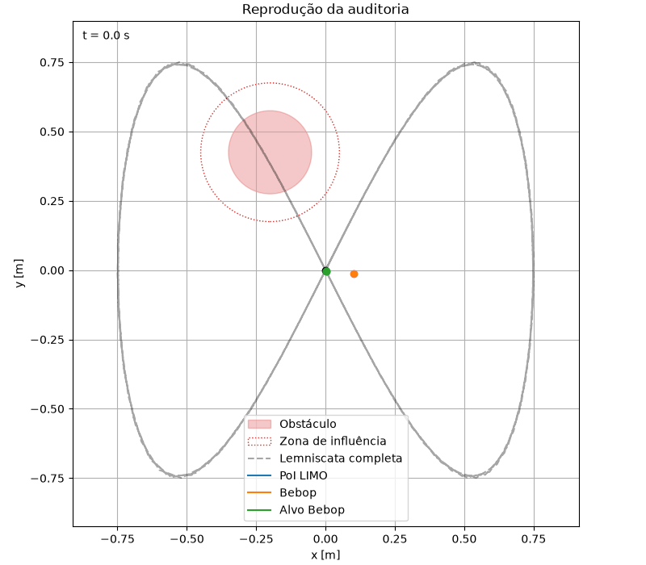

# Formação virtual LIMO–Bebop 2

Projeto da disciplina **Robótica Móvel — UFES (2026/1)**. O repositório reúne:

- um simulador Python da estrutura virtual;
- controladores MATLAB conectados a ROS, OptiTrack, LIMO e Bebop 2;
- uma auditoria em TXT e um visualizador Python para validar a execução offline.

> O Bebop 2 é a plataforma aérea adotada neste projeto. Não use os scripts destinados ao Crazyflie para executar a formação LIMO–Bebop.

## Demonstração

Reprodução da auditoria com o LIMO, Bebop virtual, referência da lemniscata, alvo da formação e obstáculo:



## Objetivo

Controlar uma estrutura virtual formada por um LIMO diferencial e um Bebop 2. A arquitetura é composta por:

1. controlador cinemático de formação;
2. desvio de obstáculo por espaço nulo;
3. laço dinâmico do LIMO;
4. laço dinâmico do Bebop;
5. integração da planta virtual no modo de auditoria.

O ponto de interesse do LIMO é deslocado `a = 0.10 m` à frente do centro de gravidade. Na trajetória de formação, o Bebop permanece verticalmente acima desse ponto, a `1.5 m`.

## Referência e obstáculo

Com `TRAJ = 1`, a referência é uma lemniscata:

$$
x_d = 0.75\sin\left(\frac{2\pi t}{40}\right), \qquad
y_d = 0.75\sin\left(\frac{4\pi t}{40}\right)
$$

O controlador usa período nominal de `1/30 s`. O obstáculo é centrado em `[-0.20; 0.425] m`, com raio físico de `0.15 m` e zona de influência de `0.25 m`.

## Estrutura do repositório

```text
matlab/
  formacao_2.m                    Controle e auditoria LIMO–Bebop
  limoControl.m                    Teste isolado do LIMO
  test_bebop.m                     Testes isolados do Bebop
  audit_formacao_*.txt             Auditorias geradas em execução
sim/
  visualizar_auditoria_formacao.py Visualizador de auditoria
src/
  main.py                          Simulador Python da formação
docs/
  reproducao.gif                   Demonstração da auditoria
```

## Simulador Python

### Pré-requisitos

- Python 3.12 ou superior;
- [uv](https://docs.astral.sh/uv).

### Instalação e execução

```bash
uv sync
uv run python src/main.py --output-dir results --no-show
```

Para ver todas as opções:

```bash
uv run python src/main.py --help
```

Para gerar a animação do simulador:

```bash
uv run python src/main.py --t_final 40 --anim
```

## Controle em hardware: MATLAB, ROS e OptiTrack

O arquivo principal para o par LIMO–Bebop é `matlab/formacao_2.m`.

### Pré-requisitos de laboratório

1. Inicie o ROS master em `192.168.0.100`.
2. Inicie a ponte OptiTrack:

   ```bash
   roslaunch natnet_ros_cpp natnet_ros.launch
   ```

3. No Motive, configure os corpos rígidos `L1` e `B1`.
4. Inicie o LIMO no modo diferencial/4WD:

   ```bash
   roslaunch limo_base limo_base.launch namespace:=L1
   ```

5. Inicie o driver do Bebop no namespace `B1`.
6. Conecte o joystick antes de executar o script.

O script usa os tópicos abaixo:

| Recurso | Tópico |
| --- | --- |
| Pose LIMO | `/natnet_ros/L1/pose` |
| Comando LIMO | `/L1/cmd_vel` |
| Pose Bebop | `/natnet_ros/B1/pose` |
| Comando Bebop | `/B1/cmd_vel` |
| Decolagem / pouso | `/B1/takeoff`, `/B1/land` |

### Modos de execução

Edite estas variáveis no início de `matlab/formacao_2.m`:

```matlab
TRAJ = 1;
MODO_BEBOP = 'off';
```

| Configuração | Comportamento |
| --- | --- |
| `TRAJ = 1` | LIMO segue a lemniscata; Bebop mantém a formação a `1.5 m` acima do PoI. |
| `TRAJ = 0` | LIMO converge para `[0; 0]`; Bebop converge para `[0; 0; 1] m`. |
| `MODO_BEBOP = 'off'` | Não envia comandos ao Bebop; integra uma planta virtual para auditoria. |
| `MODO_BEBOP = 'teste'` | Lê o Bebop e publica `cmd_vel`, sem decolagem. |
| `MODO_BEBOP = 'voo'` | Decola, controla e pousa o Bebop. |

### Sequência segura

1. Rode `limoControl.m` para validar o LIMO sozinho.
2. Rode `formacao_2.m` com `MODO_BEBOP = 'off'`.
3. Analise a auditoria gerada.
4. Valide o Bebop isoladamente e os sinais de comando em bancada.
5. Use `MODO_BEBOP = 'teste'`.
6. Faça o primeiro voo apenas em área livre, com parada de emergência disponível.

## Auditoria e visualização

Com `cfg.audit_enabled = true`, `formacao_2.m` registra arquivos `audit_formacao_*.txt`. No modo `off`, o arquivo representa a resposta da planta virtual:

$$
\dot{v} = f_1u - f_2v
$$

O log contém posição e alvo do Bebop, referência do LIMO, comandos, resíduos cinemáticos/dinâmicos, saturações e resumo de erro.

Para gerar gráficos e uma animação a partir de um audit:

```bash
uv run python sim/visualizar_auditoria_formacao.py \
  matlab/audit_formacao_YYYYMMDD_HHMMSS.txt --gif
```

Os arquivos são salvos em `matlab/audit_formacao_..._visualizacao/`:

- `trajetoria_xy.png`;
- `sinais_e_metricas.png`;
- `reproducao.gif`, quando usado `--gif`.

O GIF é uma reprodução das amostras registradas no TXT. Ele não substitui a simulação em alta frequência nem a validação física do Bebop.

## Critérios para leitura da auditoria

- Resíduos cinemático e dinâmico próximos de zero indicam consistência algébrica.
- Erro RMS, máximo e final do Bebop avaliam o seguimento da formação.
- Saturação recorrente indica que ganhos, referência ou limites exigem ajuste.
- A distância mínima ao obstáculo deve permanecer acima do raio físico, com margem para incerteza de pose.

## Limitações

- A auditoria `off` é uma validação do modelo, não uma prova de desempenho no voo real.
- Os parâmetros e o mapeamento de `cmd_vel` do Bebop devem ser confirmados experimentalmente antes de voo autônomo.
- O obstáculo e os limites de velocidade devem ser revisados para o espaço físico do laboratório.
