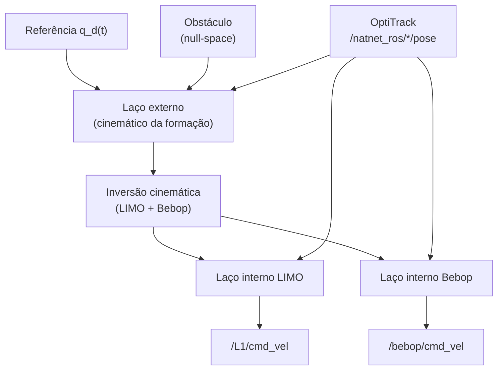

# SPEC — Trabalho Prático de Robótica Móvel (2026/1)

Especificação formal baseada em [`Especificacao do projeto.pdf`](Especificacao%20do%20projeto.pdf) (UFES / PGEE — Robótica Móvel).

Este documento define **o que** deve ser implementado. Para execução no laboratório, veja [`step-by-step.md`](step-by-step.md). Para detalhes de teoria e código, veja [`KNOWLEDGE.md`](KNOWLEDGE.md).

---

## 1. Contexto

| Item | Valor |
|------|-------|
| Disciplina | Robótica Móvel — 2026/1 |
| Local | LAB-AIR (Laboratório de Automação Inteligente e Robótica) |
| Plataformas | Robô terrestre diferencial **LIMO** + quadrimotor **Parrot Bebop 2** |
| Paradigma | **Estrutura virtual** (Virtual Structure) |
| Arquitetura | **Laço interno – laço externo** (inner–outer loops) |

---

## 2. Objetivo

Projetar um sistema de controle centralizado que:

1. Move a **formação virtual** ao longo de uma trajetória prescrita.
2. Mantém a **geometria da formação** entre LIMO e Bebop 2.
3. Compensa a **dinâmica** de cada robô (compensadores internos).
4. **Desvia de um obstáculo fixo** via controle em **espaço nulo**, com prioridade sobre a formação.

---

## 3. Arquitetura de controle



| Camada | Função |
|--------|--------|
| **Laço externo** | Controlador cinemático da estrutura virtual |
| **Espaço nulo** | Subtarefa de evasão (prioridade alta) projetada no kernel da tarefa primária |
| **Laço interno LIMO** | Compensador dinâmico do robô terrestre |
| **Laço interno Bebop** | Compensador dinâmico do quadrirrotor |

Frequência de execução: **30 Hz** → período de amostragem **T = 1/30 s**.

---

## 4. Variáveis da formação

O ponto de interesse (PoI) da formação coincide com o **ponto de controle do LIMO**, deslocado **a = 0,10 m** do centro de gravidade, sobre o eixo **X** do robô (ângulo de deslocamento 0°).

Estado da formação:

\[
\mathbf{q} = [x_f,\; y_f,\; z_f,\; \rho,\; \alpha,\; \beta]^T
\]

| Variável | Significado |
|----------|-------------|
| \(x_f, y_f, z_f\) | Posição do PoI da formação (PoI do LIMO) |
| \(\rho\) | Distância de formação LIMO–drone |
| \(\alpha\) | Inclinação vertical da formação |
| \(\beta\) | Orientação horizontal da formação |

No plano \(xy\), o LIMO ocupa o PoI \((x_f, y_f)\) com \(z_f = 0\).

---

## 5. Referência de trajetória

A formação deve seguir uma **lemniscata de Bernoulli** no plano **XY**, com o drone a **altura constante de 1,5 m**.

Referência desejada:

\[
\mathbf{q}_d =
\begin{bmatrix}
x_d \\
y_d \\
0 \\
1{,}5 \\
0° \\
90°
\end{bmatrix}
\]

com

\[
x_d = 0{,}75 \sin\!\left(\frac{2\pi t}{40}\right), \qquad
y_d = 0{,}75 \sin\!\left(\frac{4\pi t}{40}\right)
\]

| Parâmetro | Valor |
|-----------|-------|
| Período da lemniscata | 40 s |
| Amplitude | 0,75 m |
| Altura do drone | 1,5 m |
| \(\alpha_f\) | 0° |
| \(\beta_f\) | 90° |

---

## 6. Condições iniciais

### LIMO

| Grandeza | Valor |
|----------|-------|
| Posição | \((0{,}40,\; -0{,}25,\; 0{,}00)\) m |
| Orientação | Alinhado ao eixo **X** global |

### Bebop 2

| Grandeza | Valor |
|----------|-------|
| Posição relativa | ~30 cm à **esquerda** do LIMO |
| Orientação | Alinhado ao eixo **X** global |
| Altitude inicial | ~1,5 m (após decolagem) |

---

## 7. Modelos dinâmicos (laço interno)

### 7.1 LIMO

Utilizar o modelo dinâmico fornecido no enunciado (regressão linear nos parâmetros \(\boldsymbol{\theta}\)):

\[
\boldsymbol{\theta}_{\text{LIMO}} =
\begin{bmatrix}
0{,}1521 \\ 0{,}0953 \\ 0{,}0031 \\ 0{,}9840 \\ -0{,}0451 \\ 1{,}6422
\end{bmatrix}
\]

Implementação de referência: `limo_inner_loop` em [`matlab/test_limo.m`](matlab/test_limo.m) e [`matlab/main.m`](matlab/main.m).

### 7.2 Bebop 2

Modelo dinâmico em variáveis locais (near-hover):

\[
\dot{\mathbf{v}} = f_1 \mathbf{u} - f_2 \mathbf{v}
\]

Parâmetros identificados (configuração com limites do enunciado):

\[
f_1 = \mathrm{diag}(0{,}8417,\; 0{,}8354,\; 3{,}9660,\; 9{,}8524)
\]

\[
f_2 = \mathrm{diag}(0{,}18227,\; 0{,}17095,\; 4{,}0010,\; 4{,}7295)
\]

**Limites operacionais** usados na identificação:

| Limite | Valor |
|--------|-------|
| Arfagem \(\theta\) | \(\leq 5°\) |
| Rolagem \(\phi\) | \(\leq 5°\) |
| Velocidade vertical \(v_z\) | \(\leq 1\) m/s |
| Velocidade angular \(\dot\psi\) | \(\leq 100\) rad/s |

Vetor de velocidades: \(\mathbf{v} = [v_x,\; v_y,\; v_z,\; \dot\psi]^T\).

**Implementação de referência:** [`matlab/test_bebop.m`](matlab/test_bebop.m) — ver Seção 11.

---

## 8. Obstáculo e espaço nulo

### 8.1 Geometria

| Parâmetro | Valor |
|-----------|-------|
| Forma | Cilindro fixo (ex.: balde do lab) |
| Centro da base | \((-0{,}20,\; 0{,}425,\; 0{,}00)\) m |
| Raio físico | 0,15 m |

### 8.2 Zona de influência

| Parâmetro | Valor |
|-----------|-------|
| Forma | Circular |
| Centro | Centro da base do cilindro |
| Raio | **0,50 m** |

A manobra evasiva **só inicia** quando o robô (PoI) entra na zona de influência.

### 8.3 Prioridade das subtarefas

Formação **flexível** (conforme slides Part 5-2):

1. **Evitar obstáculo** (prioridade máxima)
2. **Manter formação**
3. **Seguir trajetória**

Técnica exigida: **controle baseado em espaço nulo** (null-space control).

---

## 9. Integração MATLAB + ROS (anexo do enunciado)

Códigos validados em **MATLAB 2021**. Padrão mínimo extraído do PDF e de [`matlab/refence.m`](matlab/refence.m).

### 9.1 Regra geral

```matlab
rosshutdown;   % no início E no final do script
rosinit('http://192.168.0.100:11311');
```

### 9.2 Leitura de pose (OptiTrack)

```matlab
pose = rossubscriber('/natnet_ros/NAMESPACE/pose', 'geometry_msgs/PoseStamped');
pose_latest = pose.LatestMessage.Pose;
quat = [pose_latest.Orientation.W, pose_latest.Orientation.X, ...
        pose_latest.Orientation.Y, pose_latest.Orientation.Z];
EulZYX = quat2eul(quat);                          % rad, sequência ZYX
angles = [EulZYX(3); EulZYX(2); EulZYX(1)];      % sequência XYZ
position = [pose_latest.Position.X; ...
            pose_latest.Position.Y; ...
            pose_latest.Position.Z];
```

`NAMESPACE` = nome do corpo rígido no Motive (ex.: `L1`, `B1`).

### 9.3 Comandos ao robô

```matlab
pub_cmdvel = rospublisher('/NAMESPACE/cmd_vel', 'geometry_msgs/Twist');
msg_cmdvel = rosmessage(pub_cmdvel);
send(pub_cmdvel, msg_cmdvel);
```

| Robô | `cmd_vel` | Campos usados |
|------|-----------|---------------|
| **LIMO** (diferencial) | \([v;\; \omega]\) | `Linear.X`, `Angular.Z` |
| **Bebop 2** | \([v_x;\; v_y;\; v_z;\; \dot\psi]\) | `Linear.X/Y/Z`, `Angular.Z` |

### 9.4 Serviços do Bebop 2

```matlab
takeoff_client = rossvcclient('/bebop/takeoff', 'std_srvs/Empty');
land_client    = rossvcclient('/bebop/land',    'std_srvs/Empty');
call(takeoff_client, rosmessage(takeoff_client));
call(land_client,    rosmessage(land_client));
```

### 9.5 Joystick

```matlab
J = JoyControl;       % wrapper do lab (substitui vrjoystick do anexo)
mRead(J);
Analog  = J.pAnalog;
Digital = J.pDigital;
```

### 9.6 Loop de controle (30 Hz)

```matlab
T = 1/30;
while toc(t0) < t_final
    loop_start = tic;
    % 1) ler poses
    % 2) calcular controle
    % 3) enviar cmd_vel
    pause(max(0, T - toc(loop_start)));
end
rosshutdown;
```

---

## 10. Mapeamento no repositório

| Componente | Arquivo | Escopo |
|------------|---------|--------|
| Simulador offline (LIMO + Bebop) | [`src/`](src/) | Validação sem hardware |
| Formação completa (hardware) | [`matlab/main.m`](matlab/main.m) | LIMO + drone via ROS |
| Teste isolado LIMO | [`matlab/test_limo.m`](matlab/test_limo.m) | Só terrestre |
| **Teste isolado Bebop 2** | [`matlab/test_bebop.m`](matlab/test_bebop.m) | **Só drone** |
| Snippets validados | [`matlab/refence.m`](matlab/refence.m) | Anexo do professor |

> **Nota de laboratório:** o enunciado cita Bebop 2; parte do código legado (`matlab/main.m`) usa Crazyflie (`cfX`) por disponibilidade histórica no lab. Para o Bebop 2, use [`matlab/test_bebop.m`](matlab/test_bebop.m) conforme Seção 11.

---

## 11. `test_bebop.m` — uso mínimo (Bebop 2)

Script de validação isolada do Bebop 2. Reutiliza o padrão do anexo (ROS + OptiTrack + `cmd_vel`) com o mínimo de camadas extras.

### 11.1 Pré-requisitos

1. Motive: corpo rígido **`B1`** (ou ajustar `cfg.bebop_rigid_body`)
2. Servidor ROS `.100`:
   ```bash
   roslaunch natnet_ros_cpp natnet_ros.launch
   ```
3. Bebop 2 ligado (Wi-Fi própria `192.168.42.x`)
4. Driver no PC com duas interfaces (cabo + Wi-Fi):
   ```bash
   roslaunch bebop_driver bebop_node.launch
   ```
5. `JoyControl.m` no path do MATLAB

### 11.2 Configuração (editar só o bloco `cfg`)

```matlab
cfg.mode = 'monitor';          % começar sempre aqui
cfg.T = 1/30;                  % 30 Hz (enunciado)
cfg.ros_master_host = '192.168.0.100';
cfg.bebop_namespace = 'bebop';
cfg.bebop_rigid_body = 'B1';
```

### 11.3 Sequência de testes recomendada

| Ordem | `cfg.mode` | O que valida |
|-------|------------|--------------|
| 1 | `'monitor'` | ROS + OptiTrack (sem decolar) |
| 2 | `'teleop'` | `cmd_vel` + joystick |
| 3 | `'takeoff_land'` | takeoff / hover / land |
| 4 | `'hover'` | laço externo + interno em ponto fixo |
| 5 | `'lemniscate'` | trajetória do enunciado a \(z = 1{,}5\) m |

### 11.4 Modo alvo do trabalho: `lemniscate`

Ativa o controlador completo do drone isolado:

- **Laço externo:** rastreamento com `tanh` + feedforward da referência
- **Laço interno:** compensador \( \dot v = f_1 u - f_2 v \) (eq. 4.47)
- **Referência:**

```matlab
x_d = 0.75 * sin(2*pi*t/40);
y_d = 0.75 * sin(4*pi*t/40);
z_d = 1.5;    % cfg.z_hover
```

Para executar:

```matlab
cfg.mode = 'lemniscate';
cfg.t_final = 80;    % 2 voltas completas (2 × 40 s)
run('matlab/test_bebop.m')
```

### 11.5 Interface `cmd_vel` do Bebop (diferença do anexo)

O anexo do PDF mostra `cmd_vel` genérico. No Bebop 2 com `bebop_driver`, os comandos são **velocidades**, não ângulos de atitude:

```matlab
msg_cmdvel.Linear.X  = vx;      % m/s  (frente/trás)
msg_cmdvel.Linear.Y  = vy;      % m/s  (lateral)
msg_cmdvel.Linear.Z  = vz;      % m/s  (vertical)
msg_cmdvel.Angular.Z = vyaw;    % rad/s (guinada)
```

Isso está encapsulado em `send_bebop_cmd()` dentro de [`matlab/test_bebop.m`](matlab/test_bebop.m).

### 11.6 Encerramento seguro

| Botão joystick | Ação |
|----------------|------|
| 1 (`stop`) | `land` + sair |
| 2 (`kill`) | `reset` (emergência) + sair |

Ao final: velocidade zero → `land` ou `reset` → `rosshutdown`.

### 11.7 Resultados

Com `cfg.save_results = true`, os modos `hover` e `lemniscate` salvam em `results/test_bebop/`:

- `.mat` — histórico de posição, referência e erros
- `_plot.png` — gráficos de trajetória e erro
- `_anim.gif` — animação (somente `lemniscate`)

---

## 12. Entregáveis

O trabalho deve demonstrar:

- [ ] Controlador cinemático da estrutura virtual (laço externo)
- [ ] Compensador dinâmico do LIMO (laço interno)
- [ ] Compensador dinâmico do Bebop 2 (laço interno)
- [ ] Seguimento da lemniscata de Bernoulli no plano XY
- [ ] Drone a 1,5 m de altitude constante
- [ ] Manutenção da geometria da formação (\(\rho_f\), \(\alpha_f\), \(\beta_f\))
- [ ] Desvio de obstáculo por espaço nulo (zona de 0,5 m)
- [ ] Loop a 30 Hz
- [ ] Integração MATLAB + ROS + OptiTrack

---

## 13. Referências internas

| Documento | Conteúdo |
|-----------|----------|
| [`Especificacao do projeto.pdf`](Especificacao%20do%20projeto.pdf) | Enunciado oficial |
| [`matlab/refence.m`](matlab/refence.m) | Código MATLAB validado pelo professor |
| [`step-by-step.md`](step-by-step.md) | Procedimento de execução no LAB-AIR |
| [`KNOWLEDGE.md`](KNOWLEDGE.md) | Teoria (slides) + parâmetros do código |
| [`README.md`](README.md) | Visão geral do repositório e simulador Python |
