# Loop de controle — `matlab/limo_bebop_final.m`

Diagrama do loop de controle a 30 Hz: máquina de estados do joystick (decolagem/pouso), o laço externo do LIMO (lemniscata + NSB, Eq. 5.13), o laço externo do Bebop (formação por offset fixo + yaw), os compensadores dinâmicos de ambos, e as camadas de segurança independentes do controlador.

```mermaid
flowchart TD
    Start(["Início: ROS/OptiTrack/joystick"]) --> WaitPoses["Aguardar 1ª pose do LIMO e do Bebop"]
    WaitPoses --> LOOP

    subgraph LOOP["Loop a 30 Hz (while true)"]
        direction TB
        Btns["Ler botões do joystick"] --> BtnB{"Botão B<br/>pressionado?"}
        BtnB -- "sim" --> AbortSafety["emergencia = true<br/>sair do loop"]
        BtnB -- "não" --> BtnA{"Botão A pressionado<br/>e ainda não voando?"}

        BtnA -- "sim" --> Takeoff["Enviar takeoff<br/>Aguardar takeoff_wait_s<br/>Resetar estado (t0, dvd_B, dt)<br/>voando = true"]
        Takeoff --> Voando
        BtnA -- "não" --> Voando{"Voando?"}

        Voando -- "não" --> PauseLoop["pause(T)"] --> Btns
        Voando -- "sim" --> ReadPose["Ler poses do LIMO e do Bebop"]

        ReadPose --> Watchdog{"Pose atualizou<br/>há menos de 0,5 s?"}
        Watchdog -- "não" --> AbortSafety
        Watchdog -- "sim" --> POI["Calcular PoI do LIMO<br/>(poi = x1,y1 + a1·[cosψ1,sinψ1])"]

        POI --> Wall{"Bebop fora da<br/>parede virtual?"}
        Wall -- "sim" --> AbortSafety
        Wall -- "não" --> Prep{"Em preparação?<br/>(t < preparation_time_s)"}

        Prep -- "sim" --> PrepBranch["LIMO parado (cmdL = 0)<br/>ref_xy = poi"]
        Prep -- "não" --> LimoRef["limo_reference_controller:<br/>lemniscata + lei tanh (Eq. 2)<br/>+ NSB do obstáculo (Eq. 5.13)"]
        LimoRef --> LimoDyn["limo_inner_loop:<br/>compensador dinâmico (Eq. 4.44, theta_limo)"]
        LimoDyn --> CmdL["cmdL = [v; ω]"]

        PrepBranch --> P2d["Alvo do Bebop:<br/>p2d = [poi; z1] + offset_f"]
        LimoDyn --> P2d
        P2d --> Dx2["dx2 = feedforward + Ls_B·tanh(Ls_B⁻¹·Kp_B·(p2d−p2))"]
        Dx2 --> Body["Rotação para o corpo A2inv<br/>+ yaw cinemático w_d_B"]
        Body --> VdB["vd_B = [A2inv·dx2; w_d_B]"]
        VdB --> Deriv["dvd_B = (vd_B − vd_B_ant)/dt<br/>(zerado no 1º ciclo de voo e na<br/>transição preparação → formação)"]
        Deriv --> BebopDyn["Compensador dinâmico do Bebop<br/>cmdB_raw = f1⁻¹(dvd_B + KD_B·(vd_B−vB_meas) + f2·vB_meas)"]
        BebopDyn --> Sat["Saturação (cmdB_max)"]
        Sat --> CmdB["cmdB"]

        CmdL --> SendL["Publicar /L1/cmd_vel"]
        CmdB --> SendB["Publicar /B1/cmd_vel"]
        SendL --> Audit["Histórico (H) + auditoria + log no console"]
        SendB --> Audit
        Audit --> TimeUp{"Tempo de missão<br/>concluído?"}
        TimeUp -- "sim" --> AbortSafety
        TimeUp -- "não" --> Btns
    end

    AbortSafety --> Land["Protocolo de pouso:<br/>comando nulo (LIMO + Bebop)<br/>+ land ×3 + rosshutdown"]
    Land --> End(["Fim: salvar auditoria e gráficos"])
```

## Notas de leitura

- Não existe mais um modo de "Bebop virtual" — o loop só roda de fato depois que o **Botão A** manda o takeoff real; antes disso ele fica em `PauseLoop`, só checando os botões.
- **Camadas de segurança** (watchdog do OptiTrack, parede virtual, Botão B) são independentes da lógica de controle — interrompem o loop mesmo que o cálculo de comando esteja correto, e sempre levam ao mesmo protocolo de pouso.
- A parede virtual (`Wall`) é checada logo após calcular o `PoI`, antes de qualquer cálculo de referência — ela usa a posição **medida** do Bebop (`p2`), não o alvo (`p2d`).
- `dvd_B` (aceleração desejada do Bebop) é diferença finita bruta, sem filtro — zerada no primeiro ciclo após a decolagem e na transição preparação → formação, para não gerar um pico de aceleração desejada nesses instantes.
- Não há rate limiter nem soft start no comando do Bebop — a única saturação real é `cmdB_max`, sobre o comando final (ver `docs/equacoes_controle.md`, seção 10, para o detalhe de por que `Ls_B` não conta como uma segunda camada).
