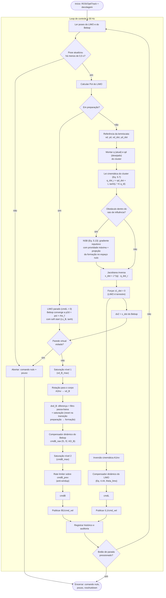

# Loop de controle — `matlab/formacao_2.m`

Diagrama do loop de controle a 30 Hz, incluindo a fase de preparação, o laço externo em espaço de cluster (Eq. 5.7 + NSB, Eq. 5.13), os laços internos do LIMO e do Bebop, e as camadas de segurança independentes do controlador.

## Notas de leitura

- **Camadas de segurança** (watchdog, parede virtual, botão de parada) são independentes da lógica de controle — interrompem o loop mesmo que o cálculo de comando esteja correto.
- O bloco **NSB** só é avaliado na fase ativa; durante a preparação o LIMO fica parado e não há obstáculo a evitar.
- `z1_dot` é sempre forçado a zero porque o LIMO é um robô terrestre — mesmo que a Jacobiana do cluster produza um valor não nulo para essa componente.
- O rate limiter atua sobre `cmdB_prev` (o último comando **realmente enviado**, não o alvo bruto), o que o torna também o mecanismo de anti-windup.
