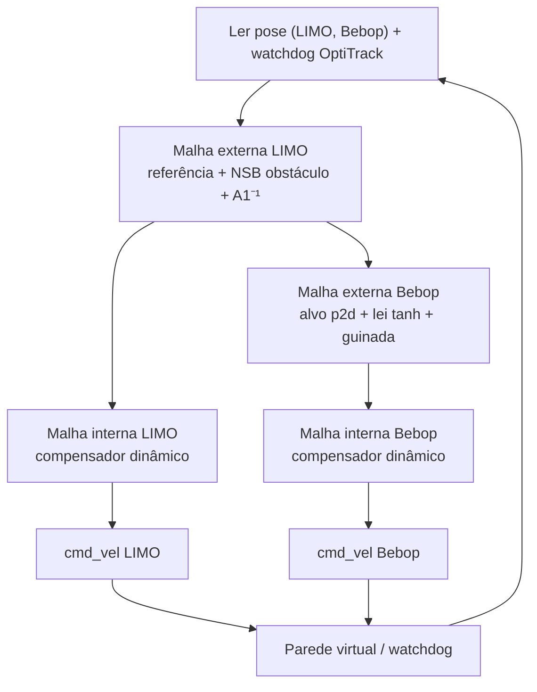

# Relatório — Formação LIMO + Bebop 2

Documento de referência do controlador de formação heterogênea LIMO (terrestre) + Bebop 2 (aéreo): decisões de projeto, malha de controle e fórmulas. Reflete o estado atual de [`matlab/formacao_2.m`](../matlab/formacao_2.m) / [`matlab/limo_bebop.m`](../matlab/limo_bebop.m).

## 1. Objetivo

- LIMO rastreia uma lemniscata de Bernoulli pelo seu ponto de interesse (PoI).
- Bebop mantém uma formação fixa em relação ao LIMO, definida por `(ρ_f, α_f, β_f)`.
- Desvio do LIMO em torno de um obstáculo fixo, com prioridade máxima (espaço nulo).
- Loop de controle a 30 Hz, com compensação dinâmica em ambos os robôs.
- Parede virtual e watchdog de OptiTrack como redes de segurança independentes do controlador.

## 2. Arquitetura (inner/outer loop)



Cada robô tem seu próprio par laço-externo (cinemático) / laço-interno (compensação dinâmica), acoplados pelo LIMO: o alvo do Bebop é sempre construído a partir da posição **real e atual** do LIMO, nunca de um ponto absoluto fixo.

## 3. Geometria da formação

Estado da formação: `q = [x_f, y_f, z_f, ρ_f, α_f, β_f]`, com `β_f` = elevação e `α_f` = azimute (medidos a partir do eixo X global), conforme o enunciado:

```
x2 = x_f + ρ_f·cos(β_f)·cos(α_f)
y2 = y_f + ρ_f·cos(β_f)·sin(α_f)
z2 = z_f + ρ_f·sin(β_f)
```

Parâmetros atuais: `ρ_f = 1,5 m`, `α_f = 0°`, `β_f = 60°` → `offset_f = [0,750; 0,000; 1,299] m`.

**Decisão**: `β_f` foi ajustado de `90°` (diretamente acima) para `60°` (ao lado). Motivo duplo: (1) solicitação explícita da orientação para o Bebop não ficar exatamente sobre o LIMO; (2) `β_f = 90°` é uma singularidade da formação — quando o drone está exatamente acima do robô terrestre, a projeção horizontal do segmento que define a estrutura vira zero e `α_f` deixa de ser observável, tornando o controlador numericamente mal-condicionado nessa configuração.

## 4. Malha externa do LIMO

Referência (lemniscata):
```
xd(t) = 0,75·sin(2πt/40)
yd(t) = 0,75·sin(4πt/40)
```

Lei cinemática (feedforward + correção saturada por `tanh`):
```
vel_poi = ref_dot + lq·tanh((kq/lq)·err_xy)
```
com atenuação do erro transversal perto do cruzamento da lemniscata (`crossing_zone_radius = 0,01 m`) para reduzir oscilação onde a curva se autointersecta.

Desvio de obstáculo (NSB, prioridade máxima sobre o rastreamento):
```
grad = ∇U(offset),  U = potencial repulsivo exponencial
task_dir = grad / ‖grad‖
vel_poi ← grad + (I − task_dir·task_dirᵀ)·vel_poi
```
O termo `(I − task_dir·task_dirᵀ)` remove apenas a componente **radial** (na direção do obstáculo) do rastreamento da lemniscata, preservando a componente tangencial — é isso que permite ao LIMO contornar o obstáculo em vez de simplesmente ser bloqueado por ele.

Inversão cinemática (unicycle estendido, ponto de interesse a `a1 = 0,10 m` à frente do eixo das rodas):
```
A1⁻¹ = [cosψ,  sinψ; −sinψ/a1,  cosψ/a1]
[v; w] = saturar(A1⁻¹ · vel_poi,  v_max, w_max)
```

## 5. Malha interna do LIMO (compensador dinâmico)

Regressão linear nos parâmetros identificados `θ_LIMO` (feedback linearization / computed torque):
```
Y1 = [u, 0, w², 0, 0, 0; 0, w, 0, u, uw, w]
u_control = Y1·θ + K_D·(v_d − v)
M1·v̇ = u_control − C1·v   (M1, C1 derivados de θ_LIMO)
v ← v + T·v̇,   saturado em v_max, w_max
```
`K_D = diag(4, 4)`. `θ_LIMO = [0,1521; 0,0953; 0,0031; 0,9840; −0,0451; 1,6422]` (identificado experimentalmente).

## 6. Malha externa do Bebop

Alvo de formação: `p2d = [poi; z1] + offset_f` (fase ativa / preparação) — a mesma fórmula nos dois casos, já que a formação segue a posição real e atual do LIMO em ambos.

Lei cinemática (feedforward do PoI + correção saturada por `tanh`):
```
dx2 = [vel_poi; 0] + Ls_B·tanh(Ls_B⁻¹·Kp_B·(p2d − p2))
```
`Kp_B = diag(1,0; 1,0; 1,2)`, `Ls_B = diag(0,6; 0,6; 0,6)`.

**Decisão**: o feedforward vem diretamente de `vel_poi` (saída do controlador do LIMO, antes da inversão cinemática `A1⁻¹`), não da reconstrução `A1·cmdL` a partir do estado simulado do laço interno — essa reconstrução introduzia até ~49% de erro, porque a ida-e-volta `A1⁻¹→A1` só é identidade se o laço interno for identidade (e ele amplifica `ω` em ~1,77×).

Controle cinemático de guinada do Bebop (yaw regulado, não deixado livre):
```
w_d_B = k_yaw_B · wrap_π(yaw_d_B − ψ2),   saturado em wd_B_max = 0,6 rad/s
```
`yaw_d_B = 0°` (alinhado ao eixo X global), `k_yaw_B = 1,0`.

Conversão para o corpo do Bebop: `vd_B = [A2⁻¹·dx2; w_d_B]`.

## 7. Malha interna do Bebop (compensador dinâmico)

Modelo identificado `v̇ = f1·u − f2·v`:
```
f1 = diag(0,8417; 0,8354; 3,966; 9,8524)
f2 = diag(0,18227; 0,17095; 4,001; 4,7295)
```

```
dvd_B = (vd_B − vd_B_anterior) / dt   (zerado no 1º ciclo e na transição preparação→formação)
cmdB_raw = f1⁻¹·(dvd_B + K_D·(vd_B − vB_medida) + f2·vB_medida)
cmdB = saturar(cmdB_raw, cmdB_max)
```
`K_D = diag(2,5; 2,5; 2,0; 5,0)`, `cmdB_max = [0,5; 0,5; 0,3; 0,5]` (m/s, m/s, m/s, rad/s).

## 8. Decisões de projeto (resumo cronológico)

| Decisão | Motivo |
|---|---|
| `KD_B` reduzido de `diag(4,4,4,4)` para os valores atuais | `KD_B` multiplica `(vd_B − vB_medida)`, e `vB_medida` vem de diferença finita bruta da pose (ruidosa a 30 Hz) — ganho alto amplificava esse ruído e saturava o comando com frequência. Causa mais provável de uma queda anterior do Bebop. |
| Saturação de `cmd_vel` por eixo (`cmdB_max`), não um limite único | O eixo vertical do Bebop satura fisicamente mais rápido que o horizontal; um limite único era desproporcional e agressivo perto do solo/decolagem. |
| `β_f = 60°` em vez de `90°` | Ver Seção 3 — evita a singularidade da formação e atende ao pedido de manter o Bebop ao lado, não sobre o LIMO. |
| Parede virtual (`bebop_limite_xy/z = 1,8 m`) | Rede de segurança independente do controlador — aborta e pousa se o Bebop sair da caixa seguro, mesmo que o cálculo de comando esteja errado por qualquer motivo. |
| Watchdog de OptiTrack (`optitrack_timeout_s = 0,5 s`) | Evita que uma pose repetida/atrasada do OptiTrack alimente `vB_medida`/`dvd_B` com um salto artificial, amplificado pelo compensador dinâmico. |
| Feedforward do Bebop a partir de `vel_poi`, não de `A1·cmdL` reconstruído | Ver Seção 6 — elimina erro de reconstrução cinemática de até ~49%. |
| Controle cinemático de guinada do Bebop | Mantém o yaw regulado em torno de `0°` em vez de deixá-lo livre, sem exigir uma tarefa de orientação elaborada — só amortece giro espúrio e mantém alinhamento com o eixo global. |
| Atenuação de erro no cruzamento da lemniscata | A lemniscata se autointersecta na origem; sem atenuação, o controlador oscilava tentando corrigir para os dois ramos da curva ao mesmo tempo. |
| NSB de obstáculo com Jacobiana da tarefa escalar (direção do gradiente), não um seletor de posição | Uma implementação alternativa (testada e descartada) projetava a tarefa secundária removendo **toda** a componente de posição, não só a radial — isso travava o LIMO incapaz de contornar o obstáculo. A versão em produção usa a direção real do gradiente repulsivo, preservando a componente tangencial. |

## 9. Segurança

- **Parede virtual**: aborta e pousa se `|x|` ou `|y| > 1,8 m`, ou `z > 1,8 m` (Bebop).
- **Watchdog de OptiTrack**: aborta se a pose não atualizar por mais de `0,5 s`.
- **Botão de parada do joystick**: interrompe o loop a qualquer momento; comando zero é enviado a ambos os robôs ao encerrar, e o Bebop pousa automaticamente se `MODO_BEBOP == 'voo'`.
- **Saturação em dois níveis**: velocidade desejada (`vd_B_max`/`tanh`) e comando final (`cmdB_max`).

## 10. Validação realizada

1. **Simulador offline** ([`matlab/simulador_formacao_2.m`](../matlab/simulador_formacao_2.m)) — plantas virtuais de LIMO e Bebop, sem ROS/OptiTrack, para validar a malha fechada completa sem risco de hardware.
2. **Teste de convergência com pose real** ([`matlab/teste_convergencia_bebop.m`](../matlab/teste_convergencia_bebop.m)) — LIMO real parado, Bebop com pose lida via OptiTrack, nenhum comando enviado; confirma que o erro/alvo/comando calculados fazem sentido contra a geometria física real.
3. **Teste do LIMO real na lemniscata** ([`matlab/teste_limo_lemniscata.m`](../matlab/teste_limo_lemniscata.m)) — `cmd_vel` real enviado ao LIMO, Bebop só logado; confirmou convergência da trajetória (erro caindo de `~0,56 m` para poucos centímetros).
4. **Prova de alinhamento do comando** ([`sim/visualizar_auditoria_formacao.py`](../sim/visualizar_auditoria_formacao.py)) — a partir de um `audit_formacao_*.txt` real, calcula o cosseno do ângulo entre o comando de correção (`dx2`) e o vetor de erro `(p2d − p2)` amostra a amostra. Resultado do último teste: **100% das amostras com o comando apontando para reduzir o erro**, alinhamento médio de `+0,92`.
5. **Testes isolados de segurança**: `matlab/teste_limo_comando_fixo.m` (bisecção de canal ROS), `matlab/teste_joystick_takeoff_land.m` (takeoff/land via joystick).

## 11. Mapa de arquivos

| Arquivo | Papel |
|---|---|
| `matlab/formacao_2.m` | Script principal, com histórico de decisões comentado. |
| `matlab/limo_bebop.m` | Versão enxuta do mesmo controlador, organizada em seções, sem histórico — para leitura/auditoria rápida. |
| `matlab/simulador_formacao_2.m` | Simulação offline (sem hardware) da malha completa. |
| `matlab/teste_convergencia_bebop.m` | Teste isolado de convergência do Bebop, LIMO parado. |
| `matlab/teste_limo_lemniscata.m` | Teste do LIMO real na lemniscata, Bebop só logado. |
| `matlab/teste_limo_comando_fixo.m` | Bisecção: comando fixo open-loop no LIMO. |
| `matlab/teste_joystick_takeoff_land.m` | Teste isolado de takeoff/land via joystick. |
| `sim/visualizar_auditoria_formacao.py` | Gera gráficos e a prova de alinhamento a partir de um `audit_formacao_*.txt`. |
| `docs/variaveis_formacao_2.md` | Glossário das variáveis do controlador. |
| `docs/diagrama_loop_controle.md` | Diagrama do loop de controle. |
