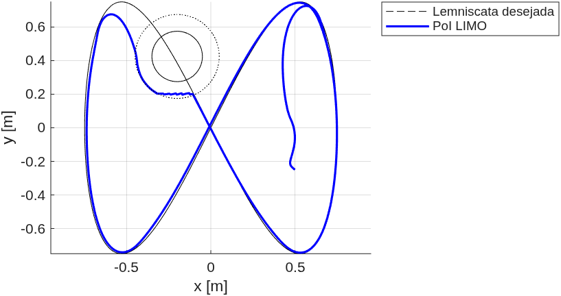
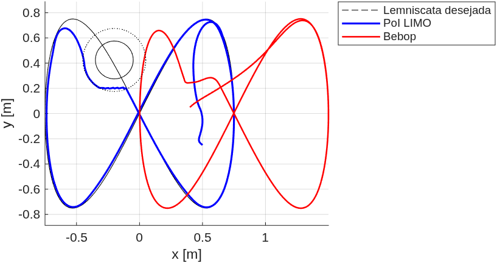
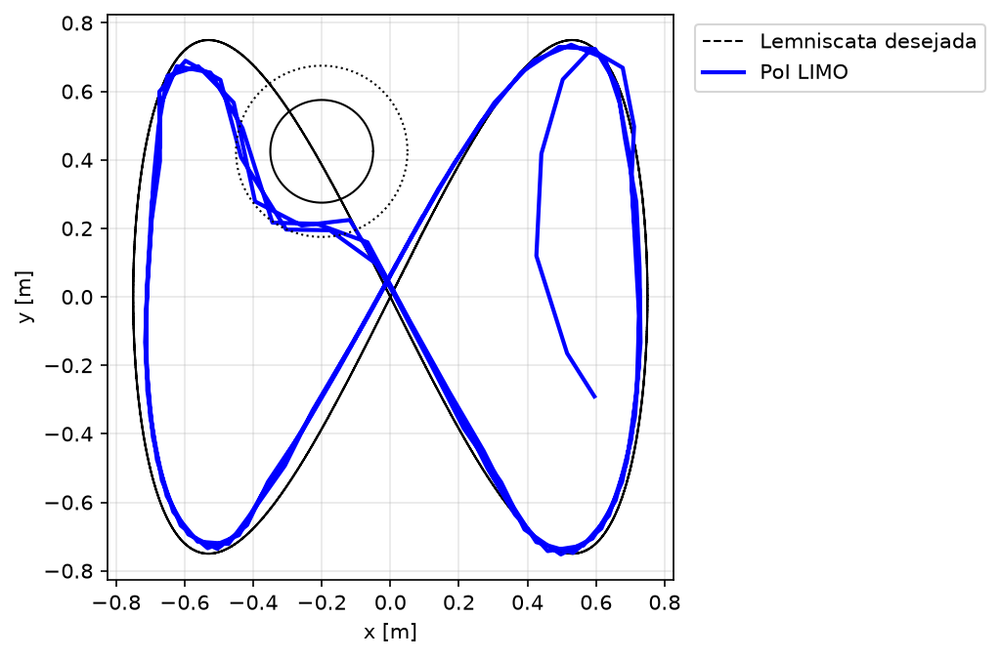

# Controle de Formação por Estrutura Virtual de um LIMO e um Bebop 2 com Desvio de Obstáculos por Espaço Nulo

**Robótica Móvel - UFES, 2026/1 - Trabalho Prático**

- Filipe Nunes da Silva Mai
- João Gabriel Santos Custodio
---

## Resumo

Este relatório descreve o projeto e a validação de um controlador de formação para uma equipe heterogênea composta por um robô terrestre diferencial (LIMO) e um quadrimotor (Parrot Bebop 2), segundo o paradigma de estrutura virtual. O controlador segue a arquitetura laço interno–laço externo: um laço cinemático externo conduz as variáveis da formação ao longo de uma lemniscata de Bernoulli, enquanto um laço interno realiza a compensação dinâmica de cada robô a partir de modelos identificados. O desvio de obstáculos é embutido como subtarefa de prioridade máxima por controle baseado em espaço nulo, com o obstáculo descrito por um campo potencial. Diferentemente da configuração original do enunciado, adota-se elevação `β_f = 60°`, para segurança. Os ensaios foram realizados na arena do LAB-AIR com captura de movimento OptiTrack e ROS. A metodologia e as equações seguem o livro de Sarcinelli-Filho e Carelli [1].

---

## 1. Introdução

O objetivo deste trabalho é controlar uma formação de dois robôs, um robô terrestre diferencial (LIMO, denotado `L1`) e um quadrimotor (Bebop 2, denotado `B1`), de modo que a formação rastreie uma trajetória desejada no plano enquanto o quadrimotor é mantido a uma altura constante em relação ao robô terrestre. Um obstáculo cilíndrico estático é posicionado no espaço de trabalho e deve ser evitado com prioridade sobre a tarefa de formação.

O controlador é projetado segundo o paradigma de estrutura virtual e a abordagem de controle comportamental baseado em espaço nulo descritos em [1]. A lei de controle completa é do tipo laço interno–laço externo: o laço externo é um controlador cinemático de formação expresso no espaço do cluster, e o laço interno é um compensador dinâmico, um para cada robô, que mapeia velocidades desejadas nos comandos efetivamente enviados aos robôs.

Este relatório apresenta o modelo, as equações de controle, os parâmetros experimentais e os resultados obtidos, incluindo uma etapa intermediária na qual apenas o robô terrestre é comandado.

---

## 2. Modelagem da Formação

### 2.1 Variáveis de cluster e mapa direto

O ponto de interesse da formação é o ponto de controle do LIMO, deslocado de uma distância `a` do seu centro de gravidade ao longo de uma reta que forma ângulo de zero graus com o eixo X do robô. As variáveis da formação (cluster) são

$$
\mathbf{q} = \begin{bmatrix} x_f & y_f & z_f & \rho_f & \alpha_f & \beta_f \end{bmatrix}^T
$$

onde `(x_f, y_f, z_f)` é a posição do ponto de controle, `ρ_f` é a distância até o drone, `α_f` é o azimute e `β_f` é a elevação do segmento que liga o ponto de controle ao drone. O mapa direto das variáveis de cluster para as posições dos robôs, seguindo [1], é

$$
x_1 = x_f, \qquad y_1 = y_f, \qquad z_1 = z_f = 0
$$

$$
x_2 = x_f + \rho_f \cos\beta_f \cos\alpha_f
$$

$$
y_2 = y_f + \rho_f \cos\beta_f \sin\alpha_f
$$

$$
z_2 = z_f + \rho_f \sin\beta_f
$$

onde os índices 1 e 2 denotam o LIMO e o drone, respectivamente. O ponto de controle é obtido da pose do LIMO por

$$
x_f = x_1 + a\cos\psi_1, \qquad y_f = y_1 + a\sin\psi_1
$$

sendo `ψ_1` a orientação do LIMO.

### 2.2 Formação e trajetória desejadas

A trajetória desejada é uma lemniscata de Bernoulli no plano,

$$
x_d = 0{,}75\,\sin\!\left(\frac{2\pi t}{40}\right), \qquad
y_d = 0{,}75\,\sin\!\left(\frac{4\pi t}{40}\right)
$$

com `z_f = 0`. O laço de controle é executado a 30 Hz, ou seja, `T = 1/30 s`.

A formação desejada mantém `α_f = 0` e `ρ_f = 1,5 m` constantes. A elevação adotada é
`β_f = 60°`, resultando no deslocamento constante, no referencial global,

$$
\Delta = \begin{bmatrix}
\rho_f\cos\beta_f\cos\alpha_f \\
\rho_f\cos\beta_f\sin\alpha_f \\
\rho_f\sin\beta_f
\end{bmatrix}
= \begin{bmatrix} 0{,}750 \\ 0{,}000 \\ 1{,}299 \end{bmatrix} \text{m}
$$

de modo que o drone voa 0,750 m à frente do ponto de controle, na direção do eixo X
global, e a 1,299 m de altura.

---

## 3. Projeto do Controle

### 3.1 Laço externo: controlador cinemático da formação

Para o ponto de controle, o laço externo usa uma lei do tipo *feedforward* mais proporcional saturado, na forma do controlador do espaço de cluster de [1, eq. 5.7],

$$
\dot{\mathbf{x}}_{r} = \dot{\mathbf{x}}_{d} + \mathbf{L}\tanh\!\left(\mathbf{L}^{-1}\mathbf{K}\,\tilde{\mathbf{x}}\right)
$$

com `x̃ = x_d − x_f` e `ẋ_d` obtido analiticamente da derivada da lemniscata. A função
`tanh` limita a parcela de realimentação a `L`, evitando comandos excessivos para erros
grandes.

Para o drone, a mesma estrutura é aplicada em três eixos, com o *feedforward* dado pela
velocidade desejada do ponto de controle e a referência de posição dada por
`p_{2d} = [x_f, y_f, 0]^T + Δ`.

### 3.2 Desvio de obstáculo por espaço nulo

O obstáculo, um cilindro centrado em `(x_{obs}, y_{obs})`, é descrito pelo campo potencial
de [1, eq. 5.20],

$$
V = \exp\left[-\left(\frac{x - x_{obs}}{a_p}\right)^n - \left(\frac{y - y_{obs}}{b_p}\right)^n\right]
$$

com `n` inteiro positivo par e `a_p`, `b_p` ajustando o espalhamento. O Jacobiano associado
é o gradiente do potencial,

$$
\mathbf{J}_o = \begin{bmatrix} \dfrac{\partial V}{\partial x} & \dfrac{\partial V}{\partial y} \end{bmatrix}
$$

e a subtarefa de desvio conduz o potencial a um valor desejado pequeno `V_d` por meio de
[1, eq. 5.22]

$$
\dot{\mathbf{x}}_{avoid} = \mathbf{J}_o^{\dagger}\left(\dot{V}_d + k_{obs}(V_d - V)\right), \qquad \dot{V}_d = 0
$$

sendo `J_o^† = J_o^T/\|J_o\|^2` a pseudo-inversa à direita.

O projetor no espaço nulo da subtarefa de desvio, `N = I − J_o^† J_o`, une as duas subtarefas, projetando a velocidade da tarefa de formação no espaço nulo da tarefa de desvio [1, eq. 5.9]:

$$
\dot{\mathbf{x}} = \dot{\mathbf{x}}_{avoid} + \mathbf{N}\,\dot{\mathbf{x}}_{r}
$$

A prioridade máxima é atribuída ao desvio, conforme exigido pelo enunciado. O desvio é ativado apenas quando o ponto de controle está dentro da zona de influência circular do obstáculo, isto é, quando `d < R_infl`. Fora dela, a tarefa de formação atua sozinha.

### 3.3 Laço interno: compensação dinâmica do LIMO

A velocidade desejada do ponto de controle é primeiro mapeada em velocidades linear e angular desejadas do LIMO pela cinemática inversa do ponto de controle,

$$
u_d = \dot{x}_r\cos\psi_1 + \dot{y}_r\sin\psi_1, \qquad
\omega_d = \frac{1}{a}\left(-\dot{x}_r\sin\psi_1 + \dot{y}_r\cos\psi_1\right)
$$

O compensador dinâmico produz então as velocidades de referência a partir do modelo identificado de [1, eq. 4.44 e 4.49],

$$
\mathbf{v}_r = \mathbf{H}\left(\dot{\mathbf{v}}_d + \mathbf{K}_D\tilde{\mathbf{v}}\right) + \mathbf{C}(\mathbf{v})\mathbf{v} + \mathbf{F}(\mathbf{v})\mathbf{v}
$$

com `ṽ = v_d − v`, `v = [u, ω]^T` medido a partir da pose do OptiTrack, e

$$
\mathbf{H} = \begin{bmatrix} \theta_1 & 0 \\ 0 & \theta_2 \end{bmatrix}, \quad
\mathbf{C} = \begin{bmatrix} 0 & -\theta_3\omega \\ \theta_3\omega & 0 \end{bmatrix}, \quad
\mathbf{F} = \begin{bmatrix} \theta_4 & 0 \\ 0 & \theta_6 + (\theta_5-\theta_3)u \end{bmatrix}
$$

### 3.4 Laço interno: compensação dinâmica do Bebop 2

O modelo dinâmico do quadrimotor, escrito em variáveis locais, é `v̇ = f₁u − f₂v`, com `f₁` e `f₂` diagonais. O laço interno inverte esse modelo [1]:

$$
\mathbf{u} = \mathbf{f}_1^{-1}\left(\dot{\mathbf{v}}_d + \mathbf{K}_{D,B}\left(\mathbf{v}_d - \mathbf{v}\right) + \mathbf{f}_2\mathbf{v}\right)
$$

A velocidade desejada no corpo é obtida rotacionando o comando global pela guinada do drone,

$$
\mathbf{v}_d = \begin{bmatrix} \mathbf{R}_z(\psi_2)^T\,\dot{\mathbf{x}}_{2r} \\ \omega_{d,\psi} \end{bmatrix}, \qquad
\omega_{d,\psi} = k_\psi\left(\psi_{2d} - \psi_2\right)
$$

com a diferença angular tratada em `±π`. A velocidade medida `v` é obtida por diferença finita da pose do OptiTrack, rotacionada para o corpo.

### 3.5 Saturações e segurança

Saturações suaves (`tanh`) e rígidas são aplicadas a todos os comandos. As rotinas de segurança implementadas para os ensaios de voo são:

- botão de parada de emergência no joystick, que zera os comandos e pousa o drone;
- bloco `try/catch` que pousa o drone em caso de erro em tempo de execução;
- parede virtual (`|x| > 1,8 m`, `|y| > 1,8 m`, `z > 1,8 m`);
- *watchdog* de perda de corpo rígido no OptiTrack (> 0,5 s), baseado no *timestamp* do
  cabeçalho da mensagem;
- modo de ensaio pré-voo (`MODO_BEBOP = 'teste'`) que lê a pose e calcula os comandos sem
  decolar.

---

## 4. Setup Experimental

Os ensaios foram realizados na arena do LAB-AIR. As poses dos robôs foram obtidas de um sistema de captura de movimento OptiTrack publicado via ROS, e os comandos de velocidade enviados a cada robô também via ROS. O laço de controle foi executado em MATLAB a 30 Hz.

O LIMO partiu de `(0,4; −0,25; 0) m` alinhado ao eixo X global, e o drone partiu cerca de 0,30 m à sua esquerda. O obstáculo foi um balde posicionado em `(−0,2; 0,425; 0) m`.

**Tabela I — Parâmetros experimentais**

| Símbolo | Descrição | Valor |
|---|---|---|
| `T` | período de amostragem | 1/30 s |
| `t_f` | duração do experimento | 120 s |
| `a` | deslocamento do ponto de controle | 0,10 m |
| `ρ_f` | distância da formação | 1,5 m |
| `α_f`, `β_f` | azimute, elevação | 0°, 60° |
| `k_q`, `l_q` | ganhos do laço externo do LIMO | 0,8; 0,30 |
| `K_p,B` | ganho do laço externo do Bebop | diag(1,0; 1,0; 1,2) |
| `L_s,B` | saturação do laço externo do Bebop | diag(0,6; 0,6; 0,6) |
| `K_D` (LIMO) | ganho do laço interno do LIMO | 4,0 |
| `K_D,B` | ganho do laço interno do Bebop | diag(2,5; 2,5; 2,0; 5,0) |
| `θ_1…6` | modelo do LIMO | 0,1521; 0,0953; 0,0031; 0,9840; −0,0451; 1,6422 |
| `f₁` | modelo do Bebop | diag(0,8417; 0,8354; 3,966; 9,8524) |
| `f₂` | modelo do Bebop | diag(0,18227; 0,17095; 4,001; 4,7295) |
| `x_obs`, `y_obs` | centro do obstáculo | (−0,20; 0,425) m |
| `r_obs` | raio do obstáculo | 0,15 m |
| `R_infl` | raio da zona de influência | 0,25 m |
| `a_p`, `b_p`, `n` | campo potencial | 0,10; 0,10; 4 |
| `v_max`, `ω_max` | saturação do LIMO | 0,30 m/s; 1,20 rad/s |
| `u_max` (Bebop) | saturação do Bebop | [0,5; 0,5; 0,3; 0,5] |
| `ψ_2d`, `k_ψ` | guinada desejada e ganho | 0 rad; 1,0 |

---

## 5. Resultados

Os resultados são apresentados em três etapas, seguindo a sequência de validação adotada: primeiro a verificação do projeto em simulação, depois o ensaio experimental com o robô terrestre isolado, e por fim o ensaio da formação completa.

### 5.1 Validação em simulação

Antes dos ensaios com o quadrimotor, o controlador foi verificado em simulação, com a planta virtual do Bebop integrada a partir do modelo dinâmico identificado (`v̇ = f₁u − f₂v`, modo `MODO_BEBOP = 'off'`). Nesta etapa o LIMO é comandado normalmente, enquanto a pose do drone é gerada pela integração do modelo, o que permite verificar a consistência algébrica das leis de controle e a geometria da formação sem risco de voo.

Figura 1 - Simulação. Trajetória desejada, caminho do ponto de controle do LIMO, obstáculo e zona de influência.

Figura 2 - Simulação. Formação completa: além do LIMO, o caminho do Bebop obtido da planta virtual. O deslocamento horizontal constante de 0,750 m no eixo X, decorrente de `β_f = 60°`, é visível na separação entre as duas curvas.

A simulação confirma que a geometria da formação é mantida ao longo de toda a trajetória e que a subtarefa de desvio afasta o ponto de controle do obstáculo.

### 5.2 Etapa intermediária: apenas o robô terrestre

Como etapa intermediária de validação, o controlador foi executado com o drone desabilitado,
comandando apenas o LIMO ao longo da lemniscata com o desvio de obstáculo ativo.

 

Figura 3 - Experimental. Trajetória desejada, caminho do LIMO, obstáculo e zona de influência.

O ponto de controle rastreia a lemniscata e se desvia do obstáculo ao entrar na zona de
influência, retornando à referência em seguida.

| Métrica | Valor |
|---|---|
| Erro de rastreio, longe do obstáculo (> 0,35 m) | RMS 0,053 m, máx 0,105 m |
| Erro de rastreio, região do obstáculo | RMS 0,231 m, máx 0,346 m |
| Erro de rastreio, global (após transitório de 5 s) | RMS 0,086 m, máx 0,346 m |
| Distância mínima ao centro do obstáculo | 0,209 m |
| Folga em relação ao raio físico (0,15 m) | 0,059 m |
| Passagens pela zona de influência | 3 (t ≈ 21, 61 e 102 s) |

A distância mínima permaneceu acima do raio físico do obstáculo em todas as três
passagens, confirmando a eficácia da subtarefa de desvio.

Figura 4 - Experimental. Distância do ponto de controle ao centro do obstáculo ao longo do tempo, com o raio do obstáculo (linha cheia, faixa sombreada) e a zona de influência (linha pontilhada) indicados.

A Figura 4 mostra as três aproximações do obstáculo, em t ≈ 21, 61 e 101 s. Em todas elas a distância mínima permaneceu acima do raio físico do obstáculo, com folga de 5,9 cm, confirmando a eficácia da subtarefa de desvio.

### 5.2 Formação completa

**Figura 2** — Experimento da formação completa: trajetória desejada, caminho do LIMO,
caminho do drone e obstáculo.
<!-- TODO -->

**Figura 3** — Altitude do drone durante o experimento.
<!-- TODO -->

**Figura 4** — Erro de formação do drone em relação ao ponto de controle.
<!-- TODO -->

**Figura 6** — Vista tridimensional da formação.
<!-- TODO -->

---

## 7. Conclusão

Foi projetado um controlador de formação por estrutura virtual com arquitetura laço interno–laço externo para uma equipe heterogênea LIMO-Bebop. O desvio de obstáculos foi embutido como subtarefa de prioridade máxima por meio de um esquema baseado em espaço nulo com campo potencial, com a tarefa de formação projetada no espaço nulo da tarefa de
desvio.

Os ensaios na arena do LAB-AIR com o robô terrestre isolado mostraram rastreio de trajetória com erro RMS de 0,053 m e folga de 5,9 cm em relação ao obstáculo.

---

## Referências

[1] M. Sarcinelli-Filho e R. Carelli, *Control of Ground and Aerial Robots*. Springer, 2023.

---
