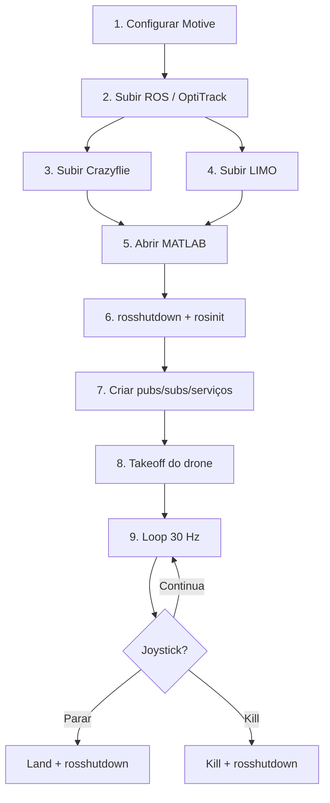

# Step-by-step — Execução no LAB-AIR

Guia prático baseado na sequência indicada em [`refence.m`](refence.m) (código validado em MATLAB 2021) e no [`main.m`](main.m) deste repositório.

---

## Visão geral da sequência



---

## Fase 1 — Antes de rodar o MATLAB

### Passo 1 — Configurar corpos rígidos no Motive (OptiTrack)

No software **Motive**, crie e nomeie os corpos rígidos exatamente como serão usados no código:

| Robô | Nome no Motive | Exemplo |
|------|----------------|---------|
| LIMO | `L1` | `L1` |
| Crazyflie | `cfX` (X = número do drone) | `cf7` |

> O nome do Crazyflie **deve** coincidir com o número usado no launch ROS.  
> Recomenda-se que o namespace do OptiTrack seja igual ao namespace ROS (facilita organização).

**Checklist**

- [ ] LIMO visível pelas câmeras OptiTrack
- [ ] Crazyflie visível pelas câmeras OptiTrack
- [ ] Corpos rígidos calibrados e publicando pose estável
- [ ] Nomes `L1` e `cfX` conferidos

---

### Passo 2 — Iniciar o bridge OptiTrack → ROS

No terminal do **servidor ROS** (IP padrão do lab: `192.168.0.100`):

```bash
roslaunch natnet_ros_cpp natnet_ros.launch
```

Isso cria os tópicos de pose para **todos** os corpos rígidos do Motive, por exemplo:

- `/natnet_ros/L1/pose`
- `/natnet_ros/cf7/pose`

**Verificar**

```bash
rostopic list | grep natnet_ros
rostopic echo /natnet_ros/L1/pose
```

---

### Passo 3 — Iniciar o servidor ROS do Crazyflie

1. Ligue o Crazyflie (bateria, rádio, posição segura para decolagem).
2. No terminal ROS:

```bash
roslaunch crazyflie_server crazyflie_server.launch cfs:=[X]
```

Substitua `X` pelo número do seu drone. Exemplo para o Crazyflie 7:

```bash
roslaunch crazyflie_server crazyflie_server.launch cfs:=[7]
```

**Checklist**

- [ ] Crazyflie conectado ao servidor
- [ ] Tópicos `/cfX/cmd_vel`, `/cfX/takeoff`, `/cfX/land`, `/cfX/kill` disponíveis

---

### Passo 4 — Iniciar o servidor ROS do LIMO

1. Ligue o LIMO.
2. Conecte via SSH a partir de um terminal Linux:

```bash
ssh agilex@192.168.0.XXX
```

`XXX` = número adesivado na lateral do robô. Senha padrão: `agx`

3. Lance o driver ROS **dentro do LIMO**:

**Modo diferencial ou ackermann (padrão do trabalho)**

```bash
roslaunch limo_base limo_base.launch namespace:=L1
```

- Pelo menos **uma** luz frontal deve estar **laranja** antes do launch.

**Modo omnidirecional** (somente LIMO 105)

```bash
roslaunch limo_base limo_base.launch namespace:=L1 use_mcnamu:=true
```

**Modo carlike**

- As **duas** luzes frontais devem estar **verdes** antes do launch.
- **Não gira no próprio eixo** (Ackermann; raio mínimo ~0,4 m). Comandos `v=0` + `ω≠0` são ignorados pelo hardware.
- No MATLAB, use `cfg.limo_steering_mode = 'carlike'` em [`test_limo.m`](test_limo.m) e [`main.m`](main.m). O código acopla automaticamente `v = ω · R_min` quando `v≈0`.

**Modo 4WD (diferencial)**

- Luzes frontais **amarelas** (travas inseridas, linha curta para frente).
- Aceita **giro no próprio eixo** (`v=0`, `ω≠0`). Use `cfg.limo_steering_mode = '4wd'`.

| Modo físico | Luz | Giro no eixo (`spin`) | Config MATLAB |
|-------------|-----|----------------------|---------------|
| 4WD | Amarela | Sim | `cfg.limo_steering_mode = '4wd'` |
| Car-like | Verde | Não (curva mínima) | `cfg.limo_steering_mode = 'carlike'` |
| Omni (LIMO 105) | Azul | Sim (+ Linear.Y) | `cfg.limo_steering_mode = 'omni'` |

**Checklist**

- [ ] Tópico `/L1/cmd_vel` disponível
- [ ] LIMO responde a comandos de teste (opcional, com cuidado)

---

## Fase 2 — Antes do loop de controle (MATLAB)

Abra o MATLAB 2021 (ou compatível com ROS Toolbox) na máquina conectada à rede do lab.

### Passo 5 — Preparar arquivos e configuração

1. Coloque [`JoyControl.m`](refence.m) no path do MATLAB (fornecido pelo professor).
2. Abra [`main.m`](main.m) e ajuste:

```matlab
cfg.ros_master_host = '192.168.0.100';
cfg.limo_namespace = 'L1';
cfg.drone_namespace = 'cf7';   % mesmo nome do Motive e do launch
cfg.limo_steering_mode = 'carlike';  % ou '4wd' se luzes amarelas
```

3. Posicione os robôs nas **condições iniciais** do enunciado:
   - LIMO em `(0.40, -0.25, 0)` m, alinhado ao eixo X
   - Crazyflie ~30 cm à esquerda do LIMO, altura segura para decolagem

---

### Passo 6 — Fechar e abrir a interface ROS

Conforme `refence.m`, **sempre** feche a interface ROS antes de reabrir:

```matlab
rosshutdown;
rosinit('192.168.0.100');
```

> O `main.m` já executa isso automaticamente no início e no fim.

---

### Passo 7 — Criar subscribers de pose (OptiTrack)

Equivalente em `refence.m`:

```matlab
pose = rossubscriber('/natnet_ros/NAMESPACE/pose', 'geometry_msgs/PoseStamped');
```

No `main.m` (dois robôs):

| Robô | Tópico |
|------|--------|
| LIMO | `/natnet_ros/L1/pose` |
| Crazyflie | `/natnet_ros/cf7/pose` |

---

### Passo 8 — Criar publishers de cmd_vel

Cada robô possui seu próprio `cmd_vel`:

```matlab
pub_cmdvel = rospublisher('/NAMESPACE/cmd_vel', 'geometry_msgs/Twist');
msg_cmdvel = rosmessage(pub_cmdvel);
```

| Robô | Tópico | Comando |
|------|--------|---------|
| LIMO | `/L1/cmd_vel` | `u = [v; ω]` |
| Crazyflie | `/cf7/cmd_vel` | `u = [φ; θ; ż; ψ̇]` |

---

### Passo 9 — Criar serviços do Crazyflie

```matlab
takeoffClient = rossvcclient('/cfX/takeoff', 'std_srvs/Trigger');
landClient    = rossvcclient('/cfX/land',   'std_srvs/Trigger');
killClient    = rossvcclient('/cfX/kill',   'std_srvs/Trigger');
```

| Serviço | Função |
|---------|--------|
| `takeoff` | Decolagem (**uma vez**, antes do loop) |
| `land` | Pouso normal ao final |
| `kill` | Emergência — desliga motores |

---

### Passo 10 — Conectar o joystick

```matlab
J = JoyControl;
```

No loop (`refence.m`):

```matlab
mRead(J);
Analog  = J.pAnalog;
Digital = J.pDigital;
```

No `main.m`:

| Botão | Ação |
|-------|------|
| `Digital(1)` | Parar loop → land |
| `Digital(2)` | Kill de emergência |

---

## Fase 3 — Dentro do loop de controle

Frequência: **30 Hz** (`T = 1/30` s).

### Passo 11 — Takeoff (apenas uma vez, antes do loop)

```matlab
takeoffResponse = call(takeoffClient, takeoffRequest, 'Timeout', 5);
pause(5);   % aguardar estabilização
```

> **Não** envie `cmd_vel` ao drone antes do takeoff.

---

### Passo 12 — Ler pose via OptiTrack (a cada iteração)

```matlab
pose_latest = pose.LatestMessage.Pose;
quat = [pose_latest.Orientation.W, pose_latest.Orientation.X, ...
        pose_latest.Orientation.Y, pose_latest.Orientation.Z];
EulZYX = quat2eul(quat);                              % rad, sequência ZYX
angles = [EulZYX(3); EulZYX(2); EulZYX(1)];           % sequência XYZ
position = [pose_latest.Position.X; ...
            pose_latest.Position.Y; ...
            pose_latest.Position.Z];
yaw = angles(3);
```

Repita para LIMO e Crazyflie.

---

### Passo 13 — Executar o controlador da formação

O `main.m` implementa automaticamente, a cada ciclo:

1. Calcular PoI do LIMO (deslocamento `a = 10 cm` no eixo X do robô)
2. Montar estado da formação `q = [xf, yf, zf, ρ, α, β]`
3. Comparar com referência da lemniscata de Bernoulli
4. Aplicar controlador cinemático (laço externo)
5. Aplicar desvio de obstáculo em espaço nulo (se PoI dentro da zona de 0,5 m)
6. Mapear via Jacobiano inverso para LIMO e drone
7. Executar compensadores dinâmicos (laço interno)

---

### Passo 14 — Enviar comandos ao Crazyflie

Vetor de comando via `cmd_vel`:

```matlab
% u = [phi; theta; zdot; psidot]
msg_cmdvel.Angular.X = phi;    % roll  (rad) — limitar a ±5°
msg_cmdvel.Angular.Y = theta;  % pitch (rad) — limitar a ±5°
msg_cmdvel.Linear.Z  = zdot;   % velocidade vertical (m/s) — máx. 1 m/s
msg_cmdvel.Angular.Z = psidot; % yaw rate (rad/s)
send(pub_cmdvel, msg_cmdvel);
```

---

### Passo 15 — Enviar comandos ao LIMO (modo diferencial)

```matlab
% u = [v; w]
msg_cmdvel.Linear.X  = v;      % m/s
msg_cmdvel.Linear.Y  = 0;      % 0 no modo diferencial
msg_cmdvel.Linear.Z  = 0;
msg_cmdvel.Angular.Z = w;      % rad/s
send(pub_cmdvel, msg_cmdvel);
```

**Modo omnidirecional** (se aplicável):

```matlab
% u = [vx; vy; w]
msg_cmdvel.Linear.X  = vx;
msg_cmdvel.Linear.Y  = vy;
msg_cmdvel.Angular.Z = w;
send(pub_cmdvel, msg_cmdvel);
```

---

### Passo 16 — Monitorar e parar

- Acompanhe os logs no Command Window (`erro rho`, `erro beta`).
- Mantenha a zona de experimento livre de pessoas.
- Use o joystick para interromper se necessário.

---

## Fase 4 — Encerramento

### Passo 17 — Parada normal

1. Enviar velocidade zero ao LIMO e ao drone.
2. Chamar serviço `land`:

```matlab
landResponse = call(landClient, landRequest, 'Timeout', 5);
```

3. Fechar ROS:

```matlab
rosshutdown;
```

### Passo 18 — Parada de emergência

Se algo sair do controle:

```matlab
killResponse = call(killClient, killRequest, 'Timeout', 5);
rosshutdown;
```

---

## Executar tudo de uma vez

Com a infraestrutura ROS já rodando (passos 1–4):

```matlab
main
```

---

## Teste inicial — só o LIMO

Antes da formação completa, use [`test_limo.m`](test_limo.m) para validar OptiTrack + ROS + `cmd_vel` **sem o drone**.

**Pré-requisitos:** passos 1, 2 e 4 deste guia (Motive `L1`, `natnet_ros`, launch do LIMO). Não é necessário subir o Crazyflie.

1. Abra `test_limo.m` e escolha o modo:

```matlab
cfg.mode = 'monitor';      % 1º teste: só ler pose (robô parado)
cfg.mode = 'teleop';       % joystick comanda v e ω
cfg.mode = 'pulse';        % sequência curta automática
cfg.mode = 'spin';         % N voltas (4WD: no eixo; car-like: curva mínima)
cfg.mode = 'lemniscate';   % figura-8 do enunciado no PoI do LIMO
cfg.t_final = 80;          % duração da lemniscata (s)
cfg.limo_steering_mode = 'carlike';  % alinhar com luzes do LIMO
cfg.ackermann_min_radius = 0.40;     % raio mínimo car-like (m)
```

2. Execute:

```matlab
test_limo
```

3. Confirme no Command Window:
   - pose atualizando (`x`, `y`, `yaw`)
   - resposta do robô nos modos `teleop` ou `pulse`
   - no modo `lemniscate`: PoI aproximando-se da referência; gráficos XY ao final
4. **Botão 1 do joystick** → para e encerra.

---

## Referência rápida de tópicos

| Item | Valor |
|------|-------|
| IP ROS | `192.168.0.100` |
| Pose LIMO | `/natnet_ros/L1/pose` |
| Pose drone | `/natnet_ros/cfX/pose` |
| cmd_vel LIMO | `/L1/cmd_vel` |
| cmd_vel drone | `/cfX/cmd_vel` |
| Takeoff | `/cfX/takeoff` |
| Land | `/cfX/land` |
| Kill | `/cfX/kill` |
| Taxa do loop | 30 Hz |

---

## Problemas comuns

| Sintoma | Possível causa | Ação |
|---------|----------------|------|
| Pose vazia no MATLAB | `natnet_ros` não rodando ou nome errado no Motive | Conferir passos 1–2 |
| Takeoff falha | Crazyflie server não iniciado | Repetir passo 3 |
| LIMO não move | Launch errado ou luz frontal incorreta | Repetir passo 4 |
| LIMO não gira (`spin`) | Modo car-like (luz verde) com `v=0` | `cfg.limo_steering_mode = 'carlike'` ou trocar para 4WD |
| Drone não responde | Takeoff não chamado | Passo 11 antes do loop |
| `rossinit` falha | IP errado ou ROS master inacessível | Ping em `192.168.0.100` |
| Erro `JoyControl` | Arquivo não está no path | Adicionar pasta ao MATLAB path |

---

## Arquivos relacionados

- [`refence.m`](refence.m) — snippets validados pelo professor
- [`main.m`](main.m) — controlador completo de estrutura virtual
- [`README.md`](README.md) — especificação do trabalho e visão geral do projeto
